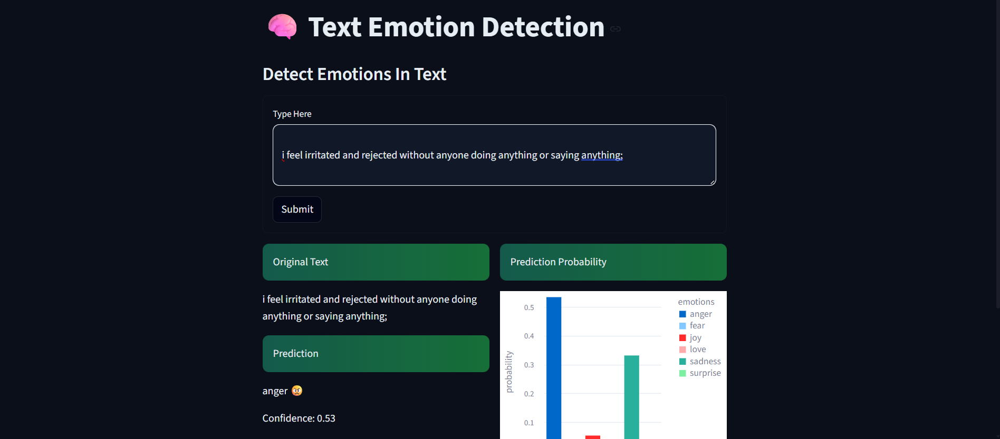
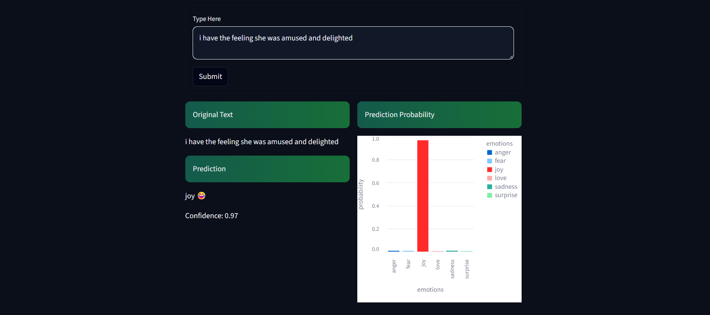

# 🧠 Text Emotion Detection Intelligence System

<p align="center">
  
  
  
  
</p>

<p align="center">
  <b>🚀 Detect Human Emotions from Text in Real Time</b><br>
  <i>An end-to-end NLP system with explainable predictions, confidence scores, and interactive visual analytics</i>
</p>

---

## 🎬 Dashboard Preview

<p align="center">
  <b>📊 Dashboard View - Prediction Interface</b>
  <br><br>
  
  <br><br><br>
  <b>📈 Dashboard View - Emotion Probability Analysis</b>
  <br><br>
  
</p>

---

## 📌 Project Vision

This project is a **production-oriented Natural Language Processing (NLP) application** that identifies the emotional tone of user-written text in real time.

Unlike basic text classifiers, this system focuses on:

* ⚡ **Instant emotion prediction**
* 😊 **Human-friendly emoji responses**
* 📊 **Confidence score visualization**
* 📈 **Probability analysis dashboard**
* 🎨 **Modern dark-themed UI**

The goal is to simulate how intelligent systems can understand human emotions and improve digital experiences.

---

## 🎯 Core Features

| Feature                 | Description                                 |
| ----------------------- | ------------------------------------------- |
| ⚡ Real-Time Prediction  | Detects emotions instantly from user input  |
| 🧠 NLP Processing       | Cleans and processes text before prediction |
| 📊 Probability Analysis | Displays class probabilities in bar chart   |
| 😊 Emoji Output         | Makes predictions intuitive and engaging    |
| 🎨 Dark Theme Dashboard | Premium Streamlit UI                        |
| 📈 Confidence Score     | Shows prediction reliability                |

---

## 🧠 Machine Learning & NLP Pipeline

### 🔹 NLP Workflow

```text
Raw Text → Cleaning → Stopword Removal → Vectorization → Logistic Regression → Emotion Prediction
```

### 🔹 Feature Extraction Techniques

* **Bag of Words (CountVectorizer)** → **88% Accuracy**
* **TF-IDF (TfidfVectorizer)** → **86% Accuracy**

### 🔹 Final Model

📌 **Selected Model: Logistic Regression + Bag of Words**

✔ Higher accuracy on test data
✔ Better prediction consistency
✔ Lightweight and deployment-friendly

---

## 📊 Model Performance

| Model Configuration          | Accuracy |
| ---------------------------- | -------- |
| Logistic Regression + BoW    | 88%      |
| Logistic Regression + TF-IDF | 86%      |

### 🏆 Why BoW Was Selected

* Delivered the **best test accuracy**
* Better generalization on short emotional texts
* Efficient for real-time Streamlit deployment

---

## 🎭 Supported Emotions

The system predicts the following emotional states:

* 😂 Joy
* 😔 Sadness
* 😠 Anger
* 😨 Fear
* ❤️ Love
* 😮 Surprise

---

## 🛠️ Tech Stack

| Layer            | Tools               |
| ---------------- | ------------------- |
| 💻 Language      | Python              |
| 🧠 NLP           | NLTK                |
| 🤖 ML            | Scikit-learn        |
| 📊 Visualization | Altair / Matplotlib |
| 🌐 UI            | Streamlit           |
| 📦 Deployment    | Streamlit Cloud     |

---

## 💡 Real-World Applications

This system can be used in:

* 💬 Mental health support systems
* 🧑‍💼 Customer feedback sentiment analysis
* 🤖 Chatbots & virtual assistants
* 📱 Social media emotion tracking
* 📊 User experience analytics

---

## 👨‍💻 Author

**Bhairav Thakare**

